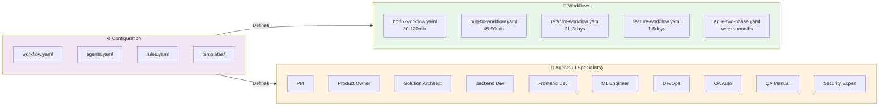
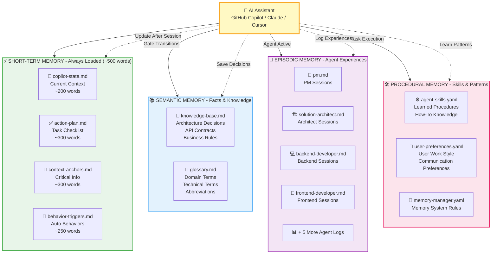
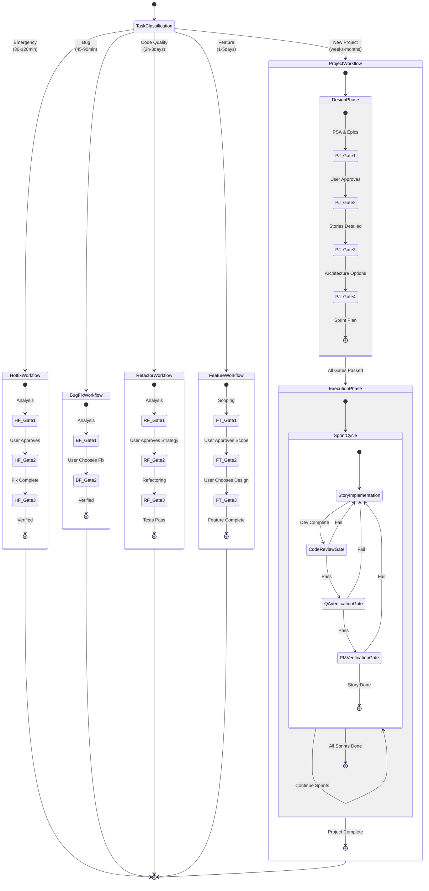
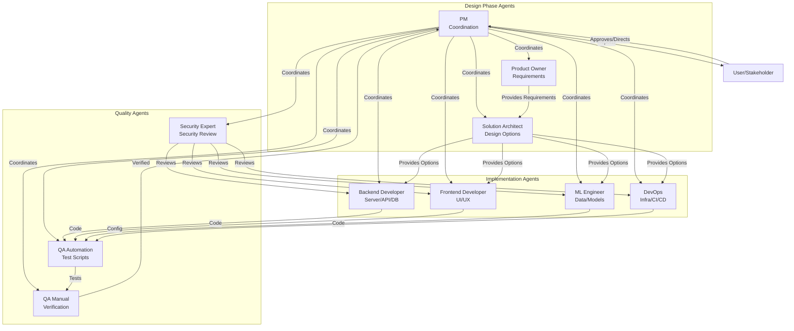
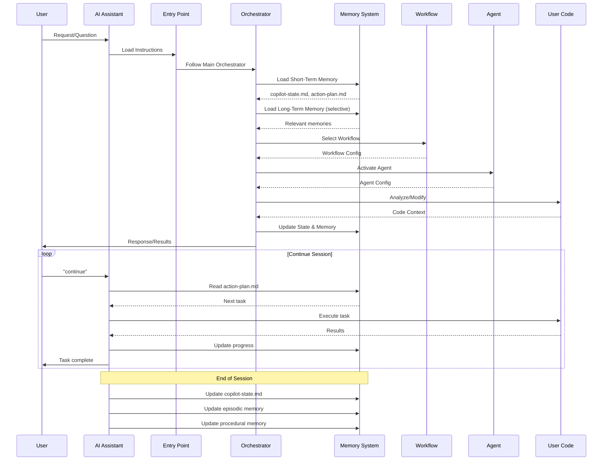
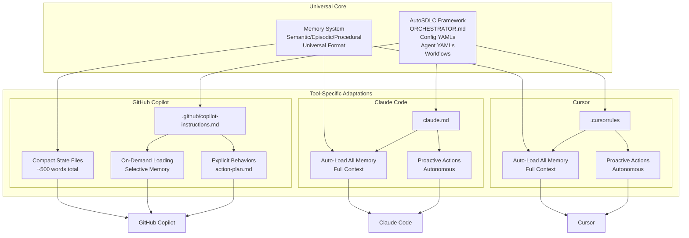

# AutoSDLC Architecture

High-level architecture of the AutoSDLC multi-agent development workflow framework with memory system.

---

## 🏗️ System Overview

### High-Level Architecture

```mermaid
flowchart TD
    USER[👤 User/Developer]
    
    AI[🤖 AI Assistant<br/>GitHub Copilot / Claude / Cursor]
    
    ENTRY[📄 Entry Points<br/>.github/copilot-instructions.md<br/>claude.md<br/>.cursorrules]
    
    ORCH[📋 ORCHESTRATOR.md<br/>Main Framework Instructions]
    
    CONFIG[⚙️ Configuration Layer<br/>workflows/ agents/ config/ templates/]
    
    MEMORY[🧠 Memory System<br/>Short-Term: State & Plans<br/>Long-Term: Semantic/Episodic/Procedural]
    
    PROJECT[💻 User Project<br/>src/ tests/ docs/]
    
    USER -->|Requests Task| AI
    AI -->|Reads Instructions| ENTRY
    ENTRY -->|Points To| ORCH
    ORCH -->|Loads Configs| CONFIG
    AI -->|Reads/Updates| MEMORY
    AI -->|Analyzes/Modifies| PROJECT
    AI -->|Delivers Results| USER
    
    style USER fill:#e3f2fd
    style AI fill:#fff9c4
    style ENTRY fill:#f3e5f5
    style ORCH fill:#e8f5e9
    style CONFIG fill:#fff3e0
    style MEMORY fill:#fce4ec
    style PROJECT fill:#e0f2f1
```



### Core Framework Components



---

## 🧠 Memory System Architecture

### Three-Tier Cognitive Memory Model



**Memory Loading Strategy:**
- **GitHub Copilot**: Compact short-term (~500 words), selective long-term (load on-demand)
- **Claude Code**: Auto-load all memory at session start (larger context window)
- **Cursor**: Auto-load all memory at session start (larger context window)

---

## 🔄 Workflow Execution Architecture



---

## 🎭 Multi-Agent System Architecture



**Agent Activation Rules:**
- **Design Phase**: PM, Product Owner, Solution Architect always active
- **Execution Phase**: All agents active as needed
- **Quality Gates**: Different agent reviews code (peer review principle)
- **Security**: Activated for security-sensitive changes

---

## 📦 File System Architecture

```
AutoSDLC/                              # Framework Definition
├── ORCHESTRATOR.md                   # Main instructions
├── ARCHITECTURE.md                   # This file
├── OVERVIEW.md                       # System overview
├── SETUP.md                          # Setup guide
├── README.md                         # Documentation
├── .github/
│   └── copilot-instructions.md       # Copilot entry point
├── claude.md                         # Claude entry point
├── .cursorrules                      # Cursor entry point
├── config/
│   ├── workflow.yaml                 # Workflow selector
│   ├── agents.yaml                   # Agent definitions
│   ├── rules.yaml                    # Quality rules
│   ├── templates-config.yaml         # Template config
│   └── copilot-adaptations.yaml      # Copilot optimizations
├── workflows/
│   ├── hotfix-workflow.yaml          # Emergency fixes
│   ├── bug-fix-workflow.yaml         # Bug fixes
│   ├── refactor-workflow.yaml        # Code quality
│   ├── feature-workflow.yaml         # Feature development
│   └── agile-two-phase.yaml          # New projects
├── agents/
│   ├── pm.yaml                       # Project Manager
│   ├── product-owner.yaml            # Requirements
│   ├── architect.yaml                # Design
│   ├── backend-dev.yaml              # Backend
│   ├── frontend-dev.yaml             # Frontend
│   ├── ml-engineer.yaml              # ML/Data
│   ├── devops.yaml                   # Infrastructure
│   ├── qa-auto.yaml                  # Test automation
│   ├── qa-manual.yaml                # Manual testing
│   └── security-expert.yaml          # Security
├── templates/
│   ├── comprehensive/                # Full templates
│   ├── moderate/                     # Medium templates
│   ├── minimal/                      # Light templates
│   ├── hotfix/                       # Hotfix templates
│   ├── security/                     # Security templates
│   └── session-context/              # Context templates
└── init/
    └── .AutoSDLC/                     # Initial state structure

.AutoSDLC/                             # State & Memory (Created at runtime)
├── status.yaml                       # Workflow state
├── session-context.md                # Session summary
├── copilot-state.md                  # Current context (Copilot)
├── action-plan.md                    # Task checklist (Copilot)
├── context-anchors.md                # Critical info (Copilot)
├── behavior-triggers.md              # Auto behaviors (Copilot)
└── memory/
    ├── semantic/
    │   ├── knowledge-base.md         # Project facts
    │   └── glossary.md               # Terminology
    ├── episodic/
    │   ├── pm.md                     # PM experiences
    │   ├── solution-architect.md     # Architect experiences
    │   ├── backend-developer.md      # Backend experiences
    │   ├── frontend-developer.md     # Frontend experiences
    │   ├── ml-engineer.md            # ML experiences
    │   ├── devops.md                 # DevOps experiences
    │   ├── qa-automation.md          # QA Auto experiences
    │   ├── qa-manual.md              # QA Manual experiences
    │   └── security-expert.md        # Security experiences
    └── procedural/
        ├── agent-skills.yaml         # Learned procedures
        ├── user-preferences.yaml     # User work style
        └── memory-manager.yaml       # Memory system config
```

---

## 🔀 Information Flow Architecture



---

## 🛠️ Tool Compatibility Architecture



**Key Design Principles:**
1. **Single Source of Truth**: One memory system, multiple access patterns
2. **Tool-Specific Entry Points**: Different files, same core framework
3. **Graceful Degradation**: Works with varying context window sizes
4. **Universal Compatibility**: No tool-specific memory formats

---

## 🔐 Quality Gate Architecture

```mermaid
graph LR
    subgraph "Story Implementation"
        DEV[Developer<br/>Implements Code]
    end
    
    DEV --> G1
    
    subgraph "Gate 1: Peer Review"
        G1{Code Review}
        G1_CHECK[Different Agent Reviews<br/>No Stubs/TODOs<br/>Tests Exist<br/>Code Quality]
    end
    
    G1 -->|Pass| G2
    G1 -->|Fail| REJECT1[REJECT<br/>Back to Dev]
    REJECT1 --> DEV
    
    subgraph "Gate 2: QA Verification"
        G2{QA Testing}
        G2_CHECK[QA Agent Tests<br/>All Tests Pass<br/>Manual Verification<br/>Acceptance Criteria]
    end
    
    G2 -->|Pass| G3
    G2 -->|Fail| REJECT2[REJECT<br/>Back to Dev]
    REJECT2 --> DEV
    
    subgraph "Gate 3: PM Verification"
        G3{PM Check}
        G3_CHECK[PM Spot-Checks<br/>Verifies Reports<br/>Definition of Done<br/>Updates Status]
    end
    
    G3 -->|Pass| DONE[Story Complete ✅]
    G3 -->|Fail| REJECT3[REJECT<br/>Back to Dev]
    REJECT3 --> DEV
```



**Gate Enforcement Rules:**
- No gate can be skipped
- Each gate requires explicit pass from designated agent
- Failed gates send work back to developer
- User approval NOT required for story-level gates (only workflow gates)
- All three gates must pass before story marked complete

---

## 📊 State Management Architecture

```mermaid
graph TD
    subgraph "Session Lifecycle"
        START[Session Start]
        WORK[Active Work]
        END[Session End]
    end
    
    subgraph "State Files"
        STATUS[status.yaml<br/>phase, gate, agent]
        CONTEXT[session-context.md<br/>summary, decisions]
        COPILOT[copilot-state.md<br/>current task]
        PLAN[action-plan.md<br/>checklist]
    end
    
    subgraph "Memory Updates"
        EPISODIC[episodic/{agent}.md<br/>learnings]
        SEMANTIC[knowledge-base.md<br/>decisions]
        PROCEDURAL[agent-skills.yaml<br/>patterns]
    end
    
    START -->|Load| STATUS
    START -->|Load| CONTEXT
    START -->|Load| COPILOT
    START -->|Load| PLAN
    
    STATUS --> WORK
    CONTEXT --> WORK
    COPILOT --> WORK
    PLAN --> WORK
    
    WORK -->|Update| STATUS
    WORK -->|Update| CONTEXT
    WORK -->|Update| COPILOT
    WORK -->|Update| PLAN
    
    END -->|Save| STATUS
    END -->|Save| CONTEXT
    END -->|Save| COPILOT
    END -->|Save| PLAN
    END -->|Append| EPISODIC
    END -->|Update If Decision| SEMANTIC
    END -->|Update If Pattern| PROCEDURAL
```

---

## 🎯 Design Principles

### 1. **Prompt Engineering, Not Software**
- Framework is text files (YAML + Markdown)
- AI reads configs and role-plays agents
- No compilation, no dependencies, no execution code

### 2. **Tool Agnostic Core**
- Universal memory system
- Tool-specific entry points
- Same methodology across all AI assistants

### 3. **User Authority**
- AI proposes OPTIONS, user decides
- Explicit approvals required at gates
- No autonomous decisions on architecture

### 4. **Quality Gates**
- Multi-gate story completion
- Peer review principle (different agent reviews)
- No incomplete work passes gates

### 5. **Memory Preservation**
- Short-term state for current context
- Long-term memory for continuity
- Semantic/Episodic/Procedural separation

### 6. **Scalable Complexity**
- Bug fix: 45 min, 2 gates, 3 agents
- New project: weeks, 4 gates, 9 agents
- Same framework, different workflows

### 7. **Session Continuity**
- Status files maintain workflow position
- Memory files preserve learnings
- Resume work across sessions

---

## 🔄 Extension Points

The architecture supports extension at multiple levels:

### New Workflows
Add `workflows/{name}-workflow.yaml` with custom phases and gates

### New Agents
Add `agents/{name}.yaml` with agent personality and responsibilities

### New Templates
Add `templates/{category}/{name}.template.md` for custom documents

### New Memory Types
Add new memory files under `.AutoSDLC/memory/` (system auto-discovers)

### Tool-Specific Optimizations
Add `config/{tool}-adaptations.yaml` for tool-specific settings

---

## 📈 Scalability Characteristics

| Aspect | Small Task | Large Task | Strategy |
|--------|-----------|-----------|----------|
| **Memory** | ~1KB state | ~50KB memory | On-demand loading |
| **Agents** | 3 active | 9 active | Selective activation |
| **Gates** | 2 gates | 4+ gates | Workflow-dependent |
| **Duration** | 45 min | Weeks | Task classification |
| **Autonomy** | Low (user decides) | High (agents work) | Phase-dependent |
| **Context** | Focused | Broad | Memory system |

---

## 🧪 Testing & Validation

The framework is self-validating:

1. **Config Validation**: AI reads YAML, catches syntax errors
2. **Gate Enforcement**: Rules.yaml enforces quality standards
3. **Memory Integrity**: Memory-manager.yaml defines access rules
4. **Cross-Session Validation**: Status files verify continuity
5. **Multi-Agent Coordination**: PM validates agent interactions

---

## 🎓 Learning Resources

- **ORCHESTRATOR.md**: Main instructions for AI assistants
- **OVERVIEW.md**: System overview and concepts
- **WORKFLOW-VISUAL-GUIDE.md**: Visual workflow diagrams
- **SETUP.md**: Installation and setup guide
- **COPILOT-SETUP.md**: GitHub Copilot specific guide
- **README.md**: Quick start and examples

---

**This architecture enables:**
- ✅ Multi-agent coordination without specialized software
- ✅ Memory preservation across sessions
- ✅ Tool-agnostic framework (Copilot/Claude/Cursor)
- ✅ Quality enforcement through gates
- ✅ User authority over all decisions
- ✅ Scalable from 45-minute bugs to months-long projects
