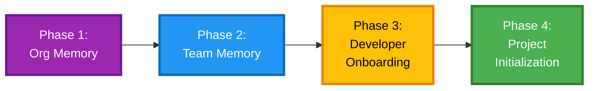

# Organizational Setup Guide

Step-by-step guide for deploying AutoSDLC with organizational memory across your company.

---

## 📋 Prerequisites

- Git installed on all machines
- Access to company Git hosting (GitHub, GitLab, Bitbucket)
- Admin permissions to create org repositories
- Team leads identified
- Developers familiar with Git workflows

---

## 🎯 Setup Overview



**Timeline:** 2-4 weeks (depending on organization size)

---

## Phase 1: Organization Memory Setup

### 1.1 Create Organization Memory Repository

**Platform:** GitHub/GitLab/Bitbucket

```bash
# As admin/devops lead
mkdir AutoSDLC-org-memory
cd AutoSDLC-org-memory

# Initialize structure
mkdir -p semantic procedural episodic/post-mortems episodic/success-stories templates

# Create initial files
cat > README.md << 'EOF'
# AutoSDLC Organization Memory

Company-wide AutoSDLC knowledge and standards.

## Structure
- `semantic/` - Architectural patterns, policies, standards
- `procedural/` - Workflows, checklists, procedures
- `episodic/` - Post-mortems, success stories
- `templates/` - Project templates

## Access
- Read: All developers
- Write: Architects, Team Leads (via PR)
- Approve: Engineering Manager
EOF

# Create initial security policies
cat > semantic/security-policies.md << 'EOF'
# Security Policies

## Authentication
- MFA required for production access
- API keys rotated every 90 days
- No hardcoded secrets in repositories

## Data Protection
- PII must be encrypted at rest
- TLS 1.3 minimum for data in transit
- Regular security audits quarterly

## Incident Response
- Security incidents reported within 1 hour
- Follow incident response playbook
- Post-mortem required for all incidents
EOF

# Create code standards
cat > procedural/code-standards.yaml << 'EOF'
code_standards:
  python:
    style_guide: "PEP 8"
    formatter: "black"
    linter: "ruff"
    type_checker: "mypy"
    line_length: 100
    
  javascript:
    style_guide: "Airbnb"
    formatter: "prettier"
    linter: "eslint"
    package_manager: "npm"
    
  git:
    commit_message: "Conventional Commits"
    branch_naming: "feature/*, fix/*, hotfix/*"
    merge_strategy: "squash"
    
  testing:
    coverage_minimum: 80
    required:
      - unit_tests
      - integration_tests
    
  documentation:
    required:
      - README.md
      - API documentation
      - Architecture Decision Records (ADRs)
EOF

# Initialize Git
git init
git add .
git commit -m "Initial organization memory structure"

# Create repository on your platform (GitHub/GitLab)
# Then push
git remote add origin git@github.com:yourcompany/AutoSDLC-org-memory.git
git branch -M main
git push -u origin main
```

### 1.2 Set Up Access Control

**GitHub:**

```yaml
# .github/CODEOWNERS
# Engineering Manager approves all changes
* @engineering-manager

# Security team for security policies
semantic/security-policies.md @security-team
procedural/security-practices.yaml @security-team

# Architects for architecture patterns
semantic/architecture-patterns.md @architects
```

**Branch Protection:**
- Require PR reviews (2 approvals)
- Require status checks to pass
- Restrict who can push to main
- Require linear history

### 1.3 Populate Initial Content

**Architecture Patterns:**

```bash
cat > semantic/architecture-patterns.md << 'EOF'
# Architecture Patterns

## Approved Patterns

### Microservices
- Use when: > 10 developers, multiple teams
- Communication: REST APIs, async messaging
- Data: Database per service
- Deployment: Kubernetes

### Monolith
- Use when: < 5 developers, MVP phase
- Architecture: Layered (presentation, business, data)
- Data: Single database
- Deployment: Single instance

### Event-Driven
- Use when: Real-time processing, high scalability
- Messaging: Kafka, RabbitMQ
- Patterns: Event sourcing, CQRS
- Deployment: Distributed

## Anti-Patterns

### Distributed Monolith
- ❌ Microservices with shared database
- ❌ Tight coupling via synchronous calls
- ❌ No clear service boundaries

### Big Ball of Mud
- ❌ No clear architecture
- ❌ Spaghetti code
- ❌ No separation of concerns
EOF
```

**Deployment Procedures:**

```bash
cat > procedural/deployment-procedures.yaml << 'EOF'
deployment:
  environments:
    - dev
    - staging
    - production
  
  workflow:
    dev:
      trigger: "on commit to main"
      approval: "automatic"
      rollback: "automatic on failure"
    
    staging:
      trigger: "manual or scheduled"
      approval: "team lead"
      smoke_tests: "required"
      rollback: "automatic on failure"
    
    production:
      trigger: "manual only"
      approval: "engineering manager + devops lead"
      requirements:
        - staging_passed: true
        - security_scan: "passed"
        - load_test: "passed"
      rollback: "manual decision"
      
  canary_deployment:
    enabled: true
    initial_traffic: 10%
    increment: 20%
    interval: "30 minutes"
    
  monitoring:
    required:
      - error_rate
      - latency_p95
      - cpu_usage
      - memory_usage
    alerting: "PagerDuty"
EOF
```

---

## Phase 2: Team Memory Setup

### 2.1 Create Team Memory Repository

**Per Team (Backend, Frontend, Mobile, etc.):**

```bash
# As team lead
mkdir AutoSDLC-backend-team-memory
cd AutoSDLC-backend-team-memory

# Initialize structure
mkdir -p semantic/architecture-decisions procedural episodic/retrospectives

cat > README.md << 'EOF'
# Backend Team Memory

Team-specific knowledge and conventions.

## Team
- Lead: Jane Doe
- Members: 8 developers
- Focus: API services, data pipelines

## Workflow
- Daily standup: 9:00 AM
- Sprint length: 2 weeks
- Retro: Every sprint end
EOF

# Create team conventions
cat > semantic/team-conventions.md << 'EOF'
# Team Conventions

## API Design
- REST for CRUD operations
- GraphQL for complex queries
- gRPC for service-to-service
- Versioning: URL path (/v1/, /v2/)

## Database
- PostgreSQL for transactional data
- Redis for caching
- MongoDB for logs/analytics

## Testing
- Jest for unit tests
- Supertest for API tests
- k6 for load testing

## Code Review
- All PRs require 1 approval
- Max PR size: 400 lines
- Review within 24 hours
EOF

# First Architecture Decision Record
mkdir -p semantic/architecture-decisions
cat > semantic/architecture-decisions/001-use-postgresql.md << 'EOF'
# ADR 001: Use PostgreSQL for Primary Database

## Status
Accepted (2025-01-15)

## Context
Need to select primary database for new microservices.

## Decision
Use PostgreSQL for all transactional data.

## Consequences
**Positive:**
- ACID compliance
- Rich query capabilities
- Strong ecosystem
- Team familiarity

**Negative:**
- Not ideal for analytics (use separate data warehouse)
- Scaling requires sharding strategy

## Alternatives Considered
- MySQL: Less robust JSON support
- MongoDB: No transactions at the time
EOF

git init
git add .
git commit -m "Initial team memory"
git remote add origin git@github.com:yourcompany/AutoSDLC-backend-memory.git
git branch -M main
git push -u origin main
```

### 2.2 Set Team Workflows

```bash
cat > procedural/team-workflows.yaml << 'EOF'
workflows:
  feature_development:
    steps:
      - create_branch: "feature/TICKET-123-description"
      - write_tests: "TDD encouraged"
      - implement: "Follow code standards"
      - self_review: "Check coverage, lint, format"
      - create_pr: "Use PR template"
      - code_review: "1 approval required"
      - merge: "Squash and merge"
      
  bug_fix:
    steps:
      - create_branch: "fix/TICKET-456-description"
      - reproduce_bug: "Add failing test"
      - fix: "Minimal change"
      - verify: "Test passes"
      - create_pr: "Reference bug ticket"
      - review: "Fast-track if P0/P1"
      - merge: "Squash and merge"
      
  hotfix:
    steps:
      - create_branch: "hotfix/description"
      - fix: "Production issue"
      - test: "Manual testing in staging"
      - approval: "Manager required"
      - deploy: "Direct to production"
      - post_mortem: "Required within 24h"
EOF
```

---

## Phase 3: Developer Onboarding

### 3.1 Fork or Use Main Repo?

**Decision Point:**

| Approach | When to Use | Pros | Cons |
|----------|-------------|------|------|
| **Use Main Repo** | No org customizations needed | ✅ Automatic updates<br/>✅ Zero maintenance | ⚠️ Can't customize core behavior |
| **Fork AutoSDLC** | Org-wide customizations required | ✅ Full control<br/>✅ Private changes | ⚠️ Manual sync with upstream |

**Recommendation**: Start with main repo, fork only if needed.

See [FORK-WORKFLOW.md](../FORK-WORKFLOW.md) for complete forking guide.

### 3.2 Global Installation Script

**If using main repo - `install-AutoSDLC-org.sh`:**

```bash
#!/bin/bash
set -e

echo "🏢 AutoSDLC Organization Setup"
echo "=============================="

# Install AutoSDLC framework from main repo
echo ""
echo "📦 Step 1: Installing AutoSDLC..."
if [ ! -d ~/.AutoSDLC-framework ]; then
    git clone https://github.com/Omniversys/AutoSDLC.git ~/.AutoSDLC-framework
    echo "✅ AutoSDLC installed"
else
    echo "✅ AutoSDLC already installed"
fi
```

**If using org fork - `install-acme-AutoSDLC.sh`:**

```bash
#!/bin/bash
set -e

echo "🏢 ACME AutoSDLC Organization Setup"
echo "===================================="

# Install AutoSDLC framework from org fork
AutoSDLC_REPO="git@github.com:yourcompany/AutoSDLC.git"

echo ""
echo "📦 Step 1: Installing ACME AutoSDLC..."
if [ ! -d ~/.AutoSDLC-framework ]; then
    git clone $AutoSDLC_REPO ~/.AutoSDLC-framework
    cd ~/.AutoSDLC-framework
    git remote add upstream https://github.com/dondetir/AutoSDLC.git
    echo "✅ ACME AutoSDLC installed"
    echo "📝 Upstream remote added for syncing"
else
    echo "✅ ACME AutoSDLC already installed"
fi

# Clone organization memory
echo ""
echo "🏢 Step 2: Setting up organization memory..."
if [ ! -d ~/.AutoSDLC/org-memory ]; then
    git clone git@github.com:yourcompany/AutoSDLC-org-memory.git ~/.AutoSDLC/org-memory
    echo "✅ Organization memory cloned"
else
    cd ~/.AutoSDLC/org-memory
    git pull origin main
    echo "✅ Organization memory updated"
fi

# Prompt for team
echo ""
echo "👥 Step 3: Select your team:"
echo "  1) Backend"
echo "  2) Frontend"
echo "  3) Mobile"
echo "  4) DevOps"
read -p "Enter choice [1-4]: " team_choice

case $team_choice in
    1) TEAM_REPO="AutoSDLC-backend-memory" ;;
    2) TEAM_REPO="AutoSDLC-frontend-memory" ;;
    3) TEAM_REPO="AutoSDLC-mobile-memory" ;;
    4) TEAM_REPO="AutoSDLC-devops-memory" ;;
    *) echo "❌ Invalid choice"; exit 1 ;;
esac

# Clone team memory
if [ ! -d ~/AutoSDLC-team-memory ]; then
    git clone git@github.com:yourcompany/$TEAM_REPO.git ~/AutoSDLC-team-memory
    echo "✅ Team memory cloned"
else
    cd ~/AutoSDLC-team-memory
    git pull origin main
    echo "✅ Team memory updated"
fi

# Initialize user memory
echo ""
echo "👤 Step 4: Initializing personal memory..."
mkdir -p ~/.AutoSDLC/global-memory/{semantic,procedural,episodic}

if [ ! -f ~/.AutoSDLC/global-memory/README.md ]; then
    cat > ~/.AutoSDLC/global-memory/README.md << 'EOF'
# Personal AutoSDLC Memory

Cross-project learnings and preferences.

This is YOUR personal knowledge base. Learnings here are:
- Private to you
- Persist across all projects
- Can be promoted to team/org level

## Usage
- Tag patterns worth promoting: #promote-to-team
- Review quarterly and archive old learnings
EOF
    echo "✅ Personal memory initialized"
else
    echo "✅ Personal memory exists"
fi

# Create daily sync script
echo ""
echo "🔄 Step 5: Setting up daily sync..."
cat > ~/.AutoSDLC/sync-memories.sh << 'EOF'
#!/bin/bash
# Daily memory sync script

echo "🔄 Syncing AutoSDLC memories..."

# Update org memory (read-only)
cd ~/.AutoSDLC/org-memory
git pull --quiet origin main
echo "✅ Org memory synced"

# Update team memory
cd ~/AutoSDLC-team-memory
git pull --quiet origin main
echo "✅ Team memory synced"

echo "✨ All memories up-to-date!"
EOF
chmod +x ~/.AutoSDLC/sync-memories.sh

echo ""
echo "✅ AutoSDLC Organization Setup Complete!"
echo ""
echo "📚 Next steps:"
echo "  1. Run daily sync: ~/.AutoSDLC/sync-memories.sh"
echo "  2. Initialize your first project: AutoSDLC init my-project"
echo "  3. Read org standards: cat ~/.AutoSDLC/org-memory/README.md"
echo ""
echo "📖 Documentation:"
echo "  - Org memory: ~/.AutoSDLC/org-memory/"
echo "  - Team memory: ~/AutoSDLC-team-memory/"
echo "  - Your memory: ~/.AutoSDLC/global-memory/"
```

**PowerShell version (org fork) `install-acme-AutoSDLC.ps1`:**

```powershell
Write-Host "🏢 ACME AutoSDLC Organization Setup" -ForegroundColor Cyan
Write-Host "====================================" -ForegroundColor Cyan

# Install AutoSDLC framework from org fork
$AutoSDLCRepo = "git@github.com:yourcompany/AutoSDLC.git"

Write-Host "`n📦 Step 1: Installing ACME AutoSDLC..." -ForegroundColor Yellow
if (-not (Test-Path "$env:USERPROFILE\.AutoSDLC-framework")) {
    git clone $AutoSDLCRepo "$env:USERPROFILE\.AutoSDLC-framework"
    Set-Location "$env:USERPROFILE\.AutoSDLC-framework"
    git remote add upstream https://github.com/dondetir/AutoSDLC.git
    Write-Host "✅ ACME AutoSDLC installed" -ForegroundColor Green
    Write-Host "📝 Upstream remote added for syncing" -ForegroundColor Cyan
} else {
    Write-Host "✅ ACME AutoSDLC already installed" -ForegroundColor Green
}

# Clone organization memory
Write-Host "`n🏢 Step 2: Setting up organization memory..." -ForegroundColor Yellow
if (-not (Test-Path "$env:USERPROFILE\.AutoSDLC\org-memory")) {
    git clone git@github.com:yourcompany/AutoSDLC-org-memory.git "$env:USERPROFILE\.AutoSDLC\org-memory"
    Write-Host "✅ Organization memory cloned" -ForegroundColor Green
} else {
    Set-Location "$env:USERPROFILE\.AutoSDLC\org-memory"
    git pull origin main
    Write-Host "✅ Organization memory updated" -ForegroundColor Green
}

# Prompt for team
Write-Host "`n👥 Step 3: Select your team:" -ForegroundColor Yellow
Write-Host "  1) Backend"
Write-Host "  2) Frontend"
Write-Host "  3) Mobile"
Write-Host "  4) DevOps"
$teamChoice = Read-Host "Enter choice [1-4]"

$teamRepo = switch ($teamChoice) {
    "1" { "AutoSDLC-backend-memory" }
    "2" { "AutoSDLC-frontend-memory" }
    "3" { "AutoSDLC-mobile-memory" }
    "4" { "AutoSDLC-devops-memory" }
    default { Write-Host "❌ Invalid choice" -ForegroundColor Red; exit 1 }
}

# Clone team memory
if (-not (Test-Path "$env:USERPROFILE\AutoSDLC-team-memory")) {
    git clone "git@github.com:yourcompany/$teamRepo.git" "$env:USERPROFILE\AutoSDLC-team-memory"
    Write-Host "✅ Team memory cloned" -ForegroundColor Green
} else {
    Set-Location "$env:USERPROFILE\AutoSDLC-team-memory"
    git pull origin main
    Write-Host "✅ Team memory updated" -ForegroundColor Green
}

# Initialize user memory
Write-Host "`n👤 Step 4: Initializing personal memory..." -ForegroundColor Yellow
New-Item -ItemType Directory -Force -Path "$env:USERPROFILE\.AutoSDLC\global-memory\semantic" | Out-Null
New-Item -ItemType Directory -Force -Path "$env:USERPROFILE\.AutoSDLC\global-memory\procedural" | Out-Null
New-Item -ItemType Directory -Force -Path "$env:USERPROFILE\.AutoSDLC\global-memory\episodic" | Out-Null

if (-not (Test-Path "$env:USERPROFILE\.AutoSDLC\global-memory\README.md")) {
    @"
# Personal AutoSDLC Memory

Cross-project learnings and preferences.
"@ | Out-File "$env:USERPROFILE\.AutoSDLC\global-memory\README.md"
    Write-Host "✅ Personal memory initialized" -ForegroundColor Green
} else {
    Write-Host "✅ Personal memory exists" -ForegroundColor Green
}

Write-Host "`n✅ AutoSDLC Organization Setup Complete!" -ForegroundColor Green
Write-Host "`n📚 Next steps:" -ForegroundColor Cyan
Write-Host "  1. Initialize project: AutoSDLC init my-project"
Write-Host "  2. Read org standards: cat `$env:USERPROFILE\.AutoSDLC\org-memory\README.md"
```

### 3.3 Distribute to Developers

**Email template:**

```
Subject: 🏢 AutoSDLC Setup Required - Action Needed

Hi Team,

We're rolling out AutoSDLC, our new development workflow framework with organizational memory.

📦 Installation (5 minutes):

[If using main repo:]
Linux/Mac:
  bash <(curl -fsSL https://your-company.com/install-AutoSDLC-org.sh)

Windows:
  Invoke-WebRequest https://your-company.com/install-AutoSDLC-org.ps1 | iex

[If using org fork:]
Linux/Mac:
  bash <(curl -fsSL https://your-company.com/install-acme-AutoSDLC.sh)

Windows:
  Invoke-WebRequest https://your-company.com/install-acme-AutoSDLC.ps1 | iex

This will:
✅ Install AutoSDLC framework
✅ Clone company standards (security, architecture, etc.)
✅ Clone your team's knowledge base
✅ Set up your personal memory workspace

📖 Resources:
- Full guide: https://wiki.company.com/AutoSDLC
- Training video: https://company.com/AutoSDLC-training
- Slack channel: #AutoSDLC-help

🚀 Next Team Meeting:
We'll do a live walkthrough on [DATE].

Questions? Reply here or ask in #AutoSDLC-help.

Thanks,
[Your Name]
```

---

## Phase 4: Project Initialization

### 4.1 Create Project Templates

**Template: Microservice**

```bash
cd ~/.AutoSDLC/org-memory/templates
mkdir -p microservice/{.AutoSDLC/memory,src,tests}

# Template structure
cat > microservice/README.md << 'EOF'
# Microservice Template

Standard template for backend microservices.

## Pre-configured:
- ✅ FastAPI (Python) / Express (Node.js)
- ✅ PostgreSQL database
- ✅ Redis caching
- ✅ Docker + docker-compose
- ✅ CI/CD pipeline
- ✅ Tests (80% coverage minimum)

## AutoSDLC Integration:
- Security policies from org memory
- Code standards from org memory
- Team conventions from team memory
EOF

# Pre-populate project memory
cat > microservice/.AutoSDLC/memory/semantic/knowledge-base.md << 'EOF'
# Knowledge Base

## Architecture
- Pattern: Microservice
- Framework: [TBD - FastAPI or Express]
- Database: PostgreSQL
- Caching: Redis

## Inherited Standards
See organization and team memory for:
- Code standards: ~/.AutoSDLC/org-memory/procedural/code-standards.yaml
- Security policies: ~/.AutoSDLC/org-memory/semantic/security-policies.md
- Team conventions: ~/AutoSDLC-team-memory/semantic/team-conventions.md
EOF

cat > microservice/.AutoSDLC/memory/inheritance.yaml << 'EOF'
inheritance:
  from:
    organization:
      source: "~/.AutoSDLC/org-memory/"
      inherit:
        - "semantic/security-policies.md"
        - "procedural/code-standards.yaml"
        - "procedural/deployment-procedures.yaml"
      mode: "reference"
    
    team:
      source: "~/AutoSDLC-team-memory/"
      inherit:
        - "semantic/team-conventions.md"
        - "procedural/team-workflows.yaml"
      mode: "reference"
EOF
```

### 4.2 Initialize New Project

**Developer workflow:**

```bash
# Copy template
cp -r ~/.AutoSDLC/org-memory/templates/microservice my-new-api
cd my-new-api

# Initialize AutoSDLC
AutoSDLC init --inherit

# This reads .AutoSDLC/memory/inheritance.yaml and:
# 1. Links org memory files (reference mode)
# 2. Links team memory files (reference mode)
# 3. Creates project-specific memory files
# 4. Sets up .github/copilot-instructions.md

# Start development
git init
git add .
git commit -m "Initial commit from template"
git remote add origin git@github.com:yourcompany/my-new-api.git
git push -u origin main

# AutoSDLC is ready!
```

---

## 🔄 Ongoing Operations

### Daily Workflow

**Every developer:**

```bash
# Morning: Sync memories (add to .bashrc or .zshrc)
alias AutoSDLC-sync='~/.AutoSDLC/sync-memories.sh'

# Before starting work:
AutoSDLC-sync
```

**Automated via cron (optional):**

```bash
# Add to crontab: crontab -e
0 9 * * 1-5 ~/.AutoSDLC/sync-memories.sh
```

### Weekly Workflow

**Team lead:**

```bash
# Review team memory updates
cd ~/AutoSDLC-team-memory
git log --since="1 week ago" --oneline

# Review promoted memories
AutoSDLC memory report --promoted --since="1 week ago"
```

### Monthly Workflow

**Organization admin:**

```bash
# Audit org memory changes
cd ~/.AutoSDLC/org-memory
git log --since="1 month ago" --stat

# Review memory health across organization
AutoSDLC memory audit --org-wide

# Clean up outdated patterns
AutoSDLC memory archive --older-than=6months
```

---

## 📊 Monitoring & Metrics

### Key Metrics to Track

```yaml
metrics:
  adoption:
    - developers_using_AutoSDLC: "Track via Git commits"
    - projects_using_templates: "Track template usage"
    - memory_sync_frequency: "Daily sync completion rate"
  
  knowledge_sharing:
    - patterns_promoted: "User → Team → Org flow"
    - memory_reuse: "How often patterns referenced"
    - contribution_rate: "PRs to team/org memory"
  
  quality:
    - memory_conflicts: "Conflicts detected & resolved"
    - outdated_patterns: "Patterns not used in 6mo"
    - coverage: "% of projects with memory setup"
```

### Analytics Dashboard

```bash
# Generate weekly report
AutoSDLC memory analytics --weekly

# Output:
# AutoSDLC Weekly Report (Week of 2025-12-02)
# ==========================================
# 
# Adoption:
#   Active Developers: 47/50 (94%)
#   Projects Using AutoSDLC: 23/30 (77%)
#   Daily Sync Rate: 89%
# 
# Knowledge Sharing:
#   Patterns Promoted:
#     User → Team: 12
#     Team → Org: 3
#   Most Reused Pattern: "API pagination strategy" (8 projects)
#   Top Contributors:
#     Alice: 5 promotions
#     Bob: 4 promotions
# 
# Quality:
#   Memory Conflicts: 2 (auto-resolved)
#   Outdated Patterns: 5 (review recommended)
#   Memory Coverage: 95%
```

---

## 🆘 Troubleshooting

### Issue: Team memory sync fails

**Symptom:** `git pull` errors in team memory

**Solution:**
```bash
cd ~/AutoSDLC-team-memory

# Check status
git status

# If conflicts:
git stash
git pull origin main
git stash pop

# Or reset (if no local changes):
git reset --hard origin/main
```

### Issue: Organization policies not applying

**Symptom:** Project doesn't inherit org security policies

**Solution:**
```bash
# Check inheritance config
cat .AutoSDLC/memory/inheritance.yaml

# Verify org memory path
ls -la ~/.AutoSDLC/org-memory/semantic/security-policies.md

# Re-run inheritance
AutoSDLC init --inherit --force
```

### Issue: Memory conflicts

**Symptom:** Different values in org vs team memory

**Solution:**
```bash
# Check conflict resolution
AutoSDLC memory check-conflicts --verbose

# Review merge rules
cat .AutoSDLC/memory/load-config.yaml

# Org always wins for security:
# Update team memory to match org
```

---

## 📚 Training Resources

### 30-Minute Quick Start

1. **Watch:** AutoSDLC overview video (10 min)
2. **Install:** Run org setup script (5 min)
3. **Practice:** Initialize sample project (10 min)
4. **Review:** Org standards and team conventions (5 min)

### Half-Day Workshop

**Morning (2 hours):**
- AutoSDLC concepts and architecture
- Organization vs Team vs User memory
- Hands-on: Setup and first project
- Q&A

**Afternoon (2 hours):**
- Memory promotion workflow
- Git collaboration on team memory
- Best practices and patterns
- Real project migration

### Self-Paced Learning

1. **Week 1:** Install and explore memories
2. **Week 2:** Start one project with AutoSDLC
3. **Week 3:** Promote first pattern to team
4. **Week 4:** Contribute to team memory

---

## ✅ Success Criteria

### Phase 1 Complete When:
- [ ] Org memory repository created and populated
- [ ] Access controls configured
- [ ] Initial policies documented
- [ ] Git workflows established

### Phase 2 Complete When:
- [ ] All teams have memory repositories
- [ ] Team conventions documented
- [ ] ADRs created for major decisions
- [ ] Team workflows automated

### Phase 3 Complete When:
- [ ] 80%+ developers onboarded
- [ ] Installation scripts working
- [ ] Daily sync working for all
- [ ] Training completed

### Phase 4 Complete When:
- [ ] Project templates available
- [ ] 50%+ new projects use templates
- [ ] Memory inheritance working
- [ ] Developers self-sufficient

---

## 🚀 Next Steps

1. **Customize this guide** for your organization
2. **Pilot with one team** (2-3 developers)
3. **Gather feedback** and iterate
4. **Roll out team by team** (not all at once)
5. **Measure and optimize** using analytics

For architecture details, see [ORGANIZATIONAL-MEMORY.md](ORGANIZATIONAL-MEMORY.md).

For technical support, contact: [devops@yourcompany.com](mailto:devops@yourcompany.com)
