# Organizational Memory System

Enterprise-grade memory persistence for AutoSDLC across sessions, projects, and teams.

---

## 🏢 Architecture Overview

### Three-Tier Memory Hierarchy

```mermaid
flowchart TD
    ORG[🏢 Organization Level<br/>~/.AutoSDLC/org-memory/<br/>Shared across ALL projects]
    TEAM[👥 Team Level<br/>Git Repo: AutoSDLC-team-memory<br/>Shared within team]
    USER[👤 User Level<br/>~/.AutoSDLC/global-memory/<br/>Personal cross-project]
    PROJ[📁 Project Level<br/>.AutoSDLC/memory/<br/>This project only]
    
    ORG -->|Inherits| TEAM
    TEAM -->|Inherits| USER
    USER -->|Inherits| PROJ
    
    style ORG fill:#9C27B0,stroke:#6A1B9A,stroke-width:3px,color:#fff
    style TEAM fill:#2196F3,stroke:#1565C0,stroke-width:3px,color:#fff
    style USER fill:#FFC107,stroke:#F57C00,stroke-width:3px,color:#000
    style PROJ fill:#4CAF50,stroke:#2E7D32,stroke-width:3px,color:#fff
```



### Loading Priority (Highest to Lowest)

1. **Project** (`.AutoSDLC/memory/`) - Overrides everything
2. **User** (`~/.AutoSDLC/global-memory/`) - Personal preferences
3. **Team** (`~/AutoSDLC-team-memory/`) - Team standards
4. **Organization** (`~/.AutoSDLC/org-memory/`) - Company-wide policies

---

## 📂 Directory Structure

### Organization Level (`~/.AutoSDLC/org-memory/`)

```
~/.AutoSDLC/org-memory/
├── README.md                          # Organization memory documentation
├── .git/                              # Optional: Version control
│
├── semantic/                          # Org-wide knowledge
│   ├── architecture-patterns.md       # Approved patterns (microservices, event-driven, etc.)
│   ├── anti-patterns.md              # What NOT to do
│   ├── security-policies.md          # Mandatory security requirements
│   ├── compliance-requirements.md     # Legal/regulatory requirements
│   └── technology-standards.md       # Approved tech stack
│
├── procedural/                        # Org-wide procedures
│   ├── code-standards.yaml           # Coding conventions
│   ├── review-checklist.yaml         # Code review requirements
│   ├── deployment-procedures.yaml    # Deployment workflows
│   ├── incident-response.yaml        # How to handle incidents
│   └── security-practices.yaml       # Security best practices
│
├── episodic/                          # Org-wide learnings
│   ├── post-mortems/                 # Incident learnings
│   │   ├── 2025-01-auth-breach.md
│   │   └── 2025-03-db-outage.md
│   └── success-stories/              # What worked well
│       ├── migration-to-k8s.md
│       └── api-redesign-2024.md
│
└── templates/                         # Project templates
    ├── web-app/
    │   ├── .AutoSDLC/
    │   └── memory/
    ├── microservice/
    └── data-pipeline/
```

### Team Level (`~/AutoSDLC-team-memory/`)

```
~/AutoSDLC-team-memory/                 # Git repo cloned locally
├── README.md
├── .git/
│
├── semantic/
│   ├── team-conventions.md           # Team-specific conventions
│   ├── domain-knowledge.md           # Business domain knowledge
│   ├── api-contracts.md              # Internal API contracts
│   └── architecture-decisions/       # Team ADRs
│       ├── 001-use-postgres.md
│       └── 002-event-sourcing.md
│
├── procedural/
│   ├── team-workflows.yaml           # How the team works
│   ├── testing-standards.yaml        # Team testing practices
│   └── collaboration-patterns.yaml   # Pair programming, reviews, etc.
│
└── episodic/
    ├── retrospectives/               # Sprint retros
    │   ├── 2025-sprint-01.md
    │   └── 2025-sprint-02.md
    └── team-learnings.md             # Cumulative team knowledge
```

### User Level (`~/.AutoSDLC/global-memory/`)

```
~/.AutoSDLC/global-memory/
├── semantic/
│   ├── personal-patterns.md          # Patterns I've found useful
│   └── tech-stack-notes.md           # Personal tech notes
│
├── procedural/
│   ├── my-workflows.yaml             # My preferred workflows
│   ├── shortcuts.yaml                # My IDE shortcuts, aliases
│   └── debugging-techniques.yaml     # My debugging approaches
│
└── episodic/
    ├── project-learnings.md          # Lessons from past projects
    └── career-notes.md               # Career development notes
```

### Project Level (`.AutoSDLC/memory/`)

```
.AutoSDLC/memory/
├── semantic/
│   ├── knowledge-base.md             # This project's facts
│   └── glossary.md                   # Project-specific terms
│
├── episodic/
│   ├── pm.md                         # PM session history
│   ├── backend-developer.md          # Backend dev history
│   └── ...                           # Other agents
│
└── procedural/
    ├── agent-skills.yaml             # Learned skills for this project
    └── user-preferences.yaml         # Preferences for this project
```

---

## 🔄 Memory Loading Strategy

### On Session Start

```yaml
# .AutoSDLC/memory/load-config.yaml
memory_loading:
  order:
    1:
      level: "project"
      path: ".AutoSDLC/memory/"
      priority: "highest"
      load: "always"
    
    2:
      level: "user"
      path: "~/.AutoSDLC/global-memory/"
      priority: "high"
      load: "if_exists"
      merge_strategy: "project_overrides_user"
    
    3:
      level: "team"
      path: "~/AutoSDLC-team-memory/"
      priority: "medium"
      load: "if_exists"
      merge_strategy: "user_overrides_team"
    
    4:
      level: "organization"
      path: "~/.AutoSDLC/org-memory/"
      priority: "baseline"
      load: "if_exists"
      merge_strategy: "team_overrides_org"
  
  # What to load based on context
  selective_loading:
    always:
      - "project/semantic/knowledge-base.md"
      - "project/semantic/glossary.md"
    
    on_architecture_question:
      - "user/semantic/personal-patterns.md"
      - "team/semantic/architecture-decisions/"
      - "org/semantic/architecture-patterns.md"
    
    on_security_task:
      - "org/semantic/security-policies.md"
      - "org/procedural/security-practices.yaml"
      - "team/procedural/security-reviews.yaml"
    
    on_deployment:
      - "org/procedural/deployment-procedures.yaml"
      - "team/procedural/ci-cd-config.yaml"
```

### Merge Strategy

```yaml
merge_rules:
  # When same key exists in multiple levels
  conflict_resolution:
    security_policies: "org_always_wins"      # Org overrides all
    code_style: "team_wins_over_user"         # Team standard wins
    personal_shortcuts: "user_wins"           # User preference wins
    project_facts: "project_always_wins"      # Project is source of truth
  
  # How to combine lists
  list_merge:
    architecture_patterns:
      strategy: "union"                       # Combine all levels
      dedup: true
    
    forbidden_practices:
      strategy: "union"                       # Combine all levels
      enforce: "all"
  
  # How to combine nested objects
  nested_merge:
    coding_standards:
      strategy: "deep_merge"                  # Merge nested keys
      override_order: ["project", "user", "team", "org"]
```

---

## 📤 Export/Import Commands

### Memory Promotion (Export Up)

```bash
# Promote a project learning to user level
AutoSDLC memory promote \
  --from .AutoSDLC/memory/semantic/knowledge-base.md \
  --to ~/.AutoSDLC/global-memory/semantic/personal-patterns.md \
  --section "API Design Patterns" \
  --tag "rest-api,pagination"

# Promote user learning to team level (requires approval)
AutoSDLC memory promote \
  --from ~/.AutoSDLC/global-memory/procedural/my-workflows.yaml \
  --to ~/AutoSDLC-team-memory/procedural/team-workflows.yaml \
  --section "error-handling-workflow" \
  --request-review

# Promote team learning to org level (requires manager approval)
AutoSDLC memory promote \
  --from ~/AutoSDLC-team-memory/semantic/architecture-decisions/001-use-postgres.md \
  --to ~/.AutoSDLC/org-memory/semantic/architecture-patterns.md \
  --requires-approval manager@company.com
```

### Memory Demotion (Import Down)

```bash
# Import org pattern to project
AutoSDLC memory import \
  --from ~/.AutoSDLC/org-memory/semantic/architecture-patterns.md \
  --to .AutoSDLC/memory/semantic/knowledge-base.md \
  --section "Microservices Communication" \
  --as-reference  # Links instead of copying

# Import team convention to user preferences
AutoSDLC memory import \
  --from ~/AutoSDLC-team-memory/procedural/code-standards.yaml \
  --to ~/.AutoSDLC/global-memory/procedural/my-workflows.yaml \
  --merge
```

### Bulk Operations

```bash
# Sync entire team memory repo
AutoSDLC memory sync --level team

# Bootstrap new project from team templates
AutoSDLC init --template team/microservice

# Export all project learnings tagged #global-worthy
AutoSDLC memory export-worthy \
  --threshold 3-uses \
  --to ~/.AutoSDLC/global-memory/
```

---

## 🔀 Git Workflow for Team Memory

### Initial Setup

```bash
# Organization admin creates org memory repo
mkdir -p ~/.AutoSDLC/org-memory
cd ~/.AutoSDLC/org-memory
git init
git remote add origin git@company.com:AutoSDLC/org-memory.git

# Team lead creates team memory repo
git clone git@company.com:teams/backend-team/AutoSDLC-memory.git ~/AutoSDLC-team-memory
```

### Daily Workflow

```bash
# Morning: Pull latest team learnings
cd ~/AutoSDLC-team-memory
git pull origin main

# During work: AI agents update memories
# (happens automatically via AutoSDLC)

# End of day: Commit and push team learnings
cd ~/AutoSDLC-team-memory
git add .
git commit -m "Add learnings from API redesign sprint"
git push origin main
```

### Pull Request Workflow

```bash
# Promote significant learning to team
cd ~/AutoSDLC-team-memory
git checkout -b feature/add-caching-pattern

# Edit memory files
vim semantic/architecture-decisions/003-redis-caching.md

git add .
git commit -m "Document Redis caching pattern for API responses"
git push origin feature/add-caching-pattern

# Open PR for team review
# Team reviews, discusses, approves
# Merge to main → everyone gets the knowledge
```

### Versioning Strategy

```bash
# Tag important knowledge milestones
cd ~/AutoSDLC-team-memory
git tag -a v1.0-microservices-complete -m "Complete microservices architecture patterns"
git push origin v1.0-microservices-complete

# Rollback if bad pattern introduced
git revert abc123
```

---

## 🔐 Access Control

### File-Level Permissions

```yaml
# ~/.AutoSDLC/org-memory/access-control.yaml
permissions:
  semantic/security-policies.md:
    read: ["all"]
    write: ["security-team", "architects"]
    approve: ["ciso"]
  
  procedural/deployment-procedures.yaml:
    read: ["all"]
    write: ["devops-team"]
    approve: ["devops-lead"]
  
  templates/:
    read: ["all"]
    write: ["architects", "senior-devs"]
    approve: ["tech-lead"]

roles:
  all: "*"
  security-team: ["alice@company.com", "bob@company.com"]
  architects: ["carol@company.com", "david@company.com"]
  ciso: ["eve@company.com"]
  devops-team: ["frank@company.com", "grace@company.com"]
  devops-lead: ["grace@company.com"]
  senior-devs: ["alice@company.com", "carol@company.com", "henry@company.com"]
  tech-lead: ["david@company.com"]
```

### Git-Based Access Control

```bash
# Use GitHub/GitLab branch protection
# main branch requires:
# - 2 approvals from team leads
# - CI checks pass (validate YAML, check for secrets)
# - No direct pushes (PR only)
```

---

## 🤖 AI Integration

### Automatic Memory Discovery

```yaml
# .AutoSDLC/behavior-triggers.md
memory_discovery:
  on_pattern_recognition:
    - detect: "Same solution used 3+ times"
      action: "Tag with #reusable-pattern"
      prompt_pm: "This pattern could be useful across projects. Export to global memory?"
  
  on_user_feedback:
    - detect: "User says 'remember this' or 'always do this'"
      action: "Tag with #user-preference"
      save_to: "user/procedural/my-workflows.yaml"
  
  on_incident_resolution:
    - detect: "Bug fixed + root cause analysis complete"
      action: "Create episodic memory entry"
      prompt_pm: "Document this for team learning?"
      if_yes: "Save to team/episodic/incidents/"
```

### Memory Update Automation

```yaml
# .AutoSDLC/memory/auto-update-config.yaml
auto_updates:
  on_architecture_decision:
    - update: "project/semantic/knowledge-base.md"
      section: "Architecture Decisions"
      format: "ADR"
    
    - check_if_reusable: true
      if_yes_prompt: "Add to team architecture patterns?"
  
  on_api_contract_change:
    - update: "project/semantic/knowledge-base.md"
      section: "API Contracts"
    
    - update: "team/semantic/api-contracts.md"
      require_approval: true
  
  on_security_finding:
    - update: "project/episodic/security-expert.md"
    
    - if_severity: "high"
      escalate_to: "org/semantic/security-policies.md"
      require_approval: "security-team"
```

### Context-Aware Loading

```javascript
// Pseudo-code for AI assistant
async function loadRelevantMemories(task, currentContext) {
  const memories = [];
  
  // Always load project context
  memories.push(await load('.AutoSDLC/memory/semantic/knowledge-base.md'));
  
  // Load based on task type
  if (task.type === 'security') {
    memories.push(
      await load('~/.AutoSDLC/org-memory/semantic/security-policies.md'),
      await load('~/AutoSDLC-team-memory/procedural/security-practices.yaml')
    );
  }
  
  if (task.type === 'architecture') {
    memories.push(
      await load('~/.AutoSDLC/org-memory/semantic/architecture-patterns.md'),
      await load('~/AutoSDLC-team-memory/semantic/architecture-decisions/'),
      await load('~/.AutoSDLC/global-memory/semantic/personal-patterns.md')
    );
  }
  
  // Load relevant agent episodic memory
  const agentMemory = await load(`.AutoSDLC/memory/episodic/${currentAgent}.md`);
  memories.push(agentMemory.recentSessions.slice(0, 5)); // Last 5 sessions
  
  return deduplicateAndMerge(memories);
}
```

---

## 🚀 Initialization & Bootstrapping

### New Developer Onboarding

```bash
# 1. Install AutoSDLC
bash <(curl -fsSL https://raw.githubusercontent.com/AutoSDLC/install.sh)

# 2. Clone organization memory (one-time)
AutoSDLC org setup \
  --org-memory git@company.com:AutoSDLC/org-memory.git \
  --team-memory git@company.com:teams/backend/AutoSDLC-memory.git

# 3. Initialize personal memory
AutoSDLC user init

# Directory structure created:
# ~/.AutoSDLC/
#   org-memory/        (git clone)
#   global-memory/     (new, personal)
# ~/AutoSDLC-team-memory/  (git clone)
```

### New Project Initialization

```bash
# Start new project with team template
AutoSDLC init my-new-api --template team/microservice

# Creates:
# my-new-api/
#   .AutoSDLC/
#     memory/
#       semantic/
#         knowledge-base.md      (pre-populated from template)
#       procedural/
#         agent-skills.yaml      (team standards imported)
#   .github/copilot-instructions.md
#   src/
#   ...

# Memory inheritance:
# ✅ Org policies (security, compliance)
# ✅ Team standards (code style, architecture)
# ✅ User preferences (personal workflows)
# ✅ Template knowledge (microservice patterns)
```

### Inheritance Configuration

```yaml
# my-new-api/.AutoSDLC/memory/inheritance.yaml
inheritance:
  from:
    organization:
      source: "~/.AutoSDLC/org-memory/"
      inherit:
        - "semantic/security-policies.md"
        - "semantic/compliance-requirements.md"
        - "procedural/deployment-procedures.yaml"
      mode: "reference"  # Link, don't copy (always up-to-date)
    
    team:
      source: "~/AutoSDLC-team-memory/"
      inherit:
        - "semantic/architecture-decisions/"
        - "semantic/api-contracts.md"
        - "procedural/code-standards.yaml"
      mode: "snapshot"  # Copy at init time
    
    user:
      source: "~/.AutoSDLC/global-memory/"
      inherit:
        - "procedural/my-workflows.yaml"
      mode: "merge"  # Combine with project settings
  
  overrides:
    allowed:
      - "procedural/agent-skills.yaml"  # Can customize per project
      - "semantic/glossary.md"          # Project-specific terms
    
    forbidden:
      - "semantic/security-policies.md"  # Must follow org policy
      - "procedural/deployment-procedures.yaml"  # Must follow org procedures
```

---

## 📊 Memory Analytics & Health

### Memory Usage Report

```bash
AutoSDLC memory report

# Output:
# Memory Health Report
# ====================
# 
# Organization Memory:
#   Location: ~/.AutoSDLC/org-memory/
#   Size: 2.3 MB
#   Last Updated: 2025-12-09
#   Files: 23
#   
# Team Memory:
#   Location: ~/AutoSDLC-team-memory/
#   Size: 1.1 MB
#   Last Synced: 2025-12-10 09:00
#   Commits Behind: 3 (run 'git pull')
#   
# User Memory:
#   Location: ~/.AutoSDLC/global-memory/
#   Size: 450 KB
#   Patterns: 15
#   Projects Referenced: 8
#   
# Project Memory:
#   Location: .AutoSDLC/memory/
#   Size: 180 KB
#   Inherited: 8 files (org: 3, team: 4, user: 1)
#   Local: 12 files
#   
# Recommendations:
#   ⚠️  Team memory 3 commits behind - run sync
#   ✅ All security policies up-to-date
#   💡 Pattern "caching-strategy" used 5x - consider promoting to team
```

### Memory Conflict Detection

```bash
AutoSDLC memory check-conflicts

# Output:
# Conflicts Detected
# ==================
# 
# 1. Code Style Conflict
#    Org: "2 spaces for indentation"
#    Team: "4 spaces for Python"
#    Project: "tabs"
#    
#    Resolution: Team overrides Org for Python
#                Project setting ignored (team wins)
#    
# 2. Security Policy Conflict
#    Org: "MFA required for production"
#    Project: "MFA optional"
#    
#    Resolution: ❌ ORG ALWAYS WINS - Updating project
#    
# 3. Workflow Preference Conflict
#    Team: "Squash merge required"
#    User: "Prefer merge commits"
#    
#    Resolution: Team wins (team standard enforced)
```

---

## 🔧 Implementation Checklist

### Phase 1: Foundation (Week 1-2)

- [ ] Create `~/.AutoSDLC/org-memory/` directory structure
- [ ] Create `~/AutoSDLC-team-memory/` Git repository
- [ ] Create `~/.AutoSDLC/global-memory/` directory structure
- [ ] Update `ORCHESTRATOR.md` with memory loading instructions
- [ ] Add `memory-loader.yaml` configuration
- [ ] Update `.github/copilot-instructions.md` with multi-tier loading

### Phase 2: Import/Export (Week 3-4)

- [ ] Create `AutoSDLC memory promote` command
- [ ] Create `AutoSDLC memory import` command
- [ ] Create `AutoSDLC memory sync` command
- [ ] Add merge conflict resolution logic
- [ ] Create memory promotion templates

### Phase 3: Automation (Week 5-6)

- [ ] Add automatic pattern detection in agents
- [ ] Create auto-promotion triggers
- [ ] Add memory usage analytics
- [ ] Create memory health checks
- [ ] Add conflict detection

### Phase 4: Access Control (Week 7-8)

- [ ] Add `access-control.yaml` parser
- [ ] Implement permission checks
- [ ] Add approval workflow for promotions
- [ ] Create audit logging

### Phase 5: Documentation & Training (Week 9-10)

- [ ] Create organization setup guide
- [ ] Create team onboarding guide
- [ ] Create memory best practices document
- [ ] Record training videos
- [ ] Create troubleshooting guide

---

## 📚 Best Practices

### For Organizations

1. **Start with mandatory policies** - Security, compliance first
2. **Version control everything** - Use Git for team/org memories
3. **Regular audits** - Review and prune outdated patterns monthly
4. **Clear ownership** - Assign maintainers for each memory domain
5. **Training required** - Onboard teams before rollout

### For Teams

1. **Weekly sync** - Pull team memory changes daily
2. **Document decisions** - Use ADR format for architecture decisions
3. **Peer review** - All memory promotions require team review
4. **Retrospective updates** - Update team learnings after each sprint
5. **Keep it current** - Archive outdated patterns, don't delete

### For Individual Developers

1. **Tag aggressively** - Tag patterns for easy discovery
2. **Selective promotion** - Only promote truly reusable patterns
3. **Respect hierarchy** - Team > User when in doubt
4. **Regular cleanup** - Archive old project memories quarterly
5. **Share learnings** - Contribute back to team memory

---

## 🆘 Troubleshooting

### Memory Not Loading

```bash
# Check memory paths
AutoSDLC memory debug --show-paths

# Validate memory files
AutoSDLC memory validate

# Check merge conflicts
AutoSDLC memory check-conflicts --verbose
```

### Git Sync Issues

```bash
# Reset team memory to remote
cd ~/AutoSDLC-team-memory
git fetch origin
git reset --hard origin/main

# Re-sync
AutoSDLC memory sync --level team --force
```

### Performance Issues

```bash
# Check memory size
AutoSDLC memory report --size

# Archive old memories
AutoSDLC memory archive --older-than 6months

# Optimize memory files
AutoSDLC memory optimize
```

---

**Next Steps:**
1. Review this architecture with your organization's DevOps/Engineering leads
2. Set up initial Git repositories for org and team memories
3. Define your organization's mandatory policies
4. Train a pilot team
5. Gradually roll out to all teams

For implementation assistance, see [ORG-SETUP-GUIDE.md](ORG-SETUP-GUIDE.md).
