# AutoSDLC Visual Workflow Guide

Visual diagrams and decision trees to help you choose and understand workflows.

**Key Innovation**: AutoSDLC includes a 3-tier memory system (semantic/episodic/procedural) that preserves context and learnings across sessions. See ARCHITECTURE.md for detailed system design.

---

## 🎯 Workflow Selection Decision Tree

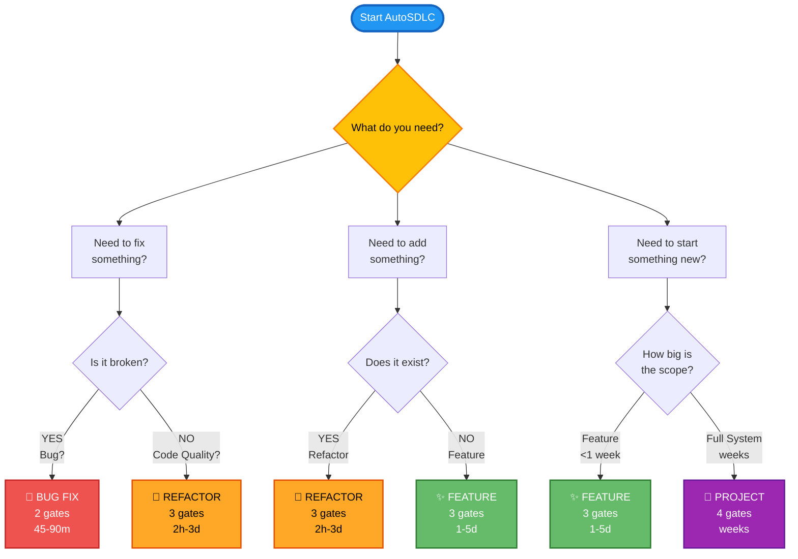

---

## 📊 Workflow Comparison Matrix

| Aspect | 🐛 Bug Fix | 🔄 Refactor | ✨ Feature | 🚀 Project |
|--------|-----------|------------|-----------|-----------|
| **Gates** | 2 | 3 | 3 | 4 |
| **Timeline** | 45-90m | 2h-3d | 1-5d | weeks |
| **Agents** | 3 | 3 | 5 | 9 |
| **Code Analysis** | Deep | V.Deep | Deep | Basic |
| **Architecture** | No | No | Yes | Yes |
| **User Control** | High | High | High | High |
| **Autonomy** | Low | Medium | Medium | High |
| **Risk Level** | Low | Medium | Medium | High |
| **Scope** | Minimal | Focused | Bounded | Full |
| **New Features** | ❌ | ❌ | ✅ | ✅ |
| **Code Changes** | Minimal | Major | Major | Major |
| **Tests** | Add 1 | Maintain | Add New | Full |

**Legend:**
- **V.Deep** = Very Deep analysis of code structure
- **Deep** = Thorough analysis of specific area
- **Basic** = High-level understanding sufficient

---

## 🔄 Gate Progression Diagrams

### Bug Fix Workflow (2 Gates)

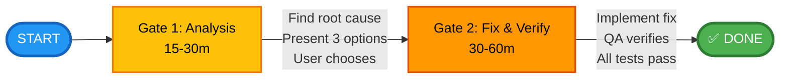

**Timeline:** 45-90 minutes

---

### Refactor Workflow (3 Gates)

```mermaid
flowchart LR
    START([START])
    G1[Gate 1: Analysis<br/>1-2h]
    G2[Gate 2: Strategy<br/>1-2h]
    G3[Gate 3: Refactor<br/>varies]
    DONE([✅ DONE])
    
    START --> G1
    G1 -->|Code smell analysis<br/>Tech debt report<br/>Metrics & impact| G2
    G2 -->|Present approaches<br/>User chooses<br/>Detailed plan| G3
    G3 -->|Small commits<br/>Tests pass continuously<br/>No behavior change| DONE
    
    style START fill:#2196F3,stroke:#1565C0,stroke-width:3px,color:#fff
    style G1 fill:#FFC107,stroke:#F57C00,stroke-width:2px,color:#000
    style G2 fill:#FF9800,stroke:#E65100,stroke-width:2px,color:#000
    style G3 fill:#FFA726,stroke:#EF6C00,stroke-width:2px,color:#000
    style DONE fill:#4CAF50,stroke:#2E7D32,stroke-width:3px,color:#fff
```

**Timeline:** 2h - 3 days

---

### Feature Workflow (3 Gates)

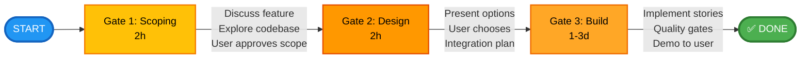

**Timeline:** 1-5 days

---

### Project Workflow (4 Gates + Execution)

```mermaid
flowchart LR
    START([START])
    
    subgraph DESIGN["PHASE 1: DESIGN"]
        G1[G1: PSA<br/>1d]
        G2[G2: Stories<br/>2d]
        G3[G3: Architecture<br/>2d]
        G4[G4: Sprint Plan<br/>1d]
    end
    
    subgraph EXEC["PHASE 2: EXECUTION"]
        BUILD[Autonomous Build<br/>weeks]
    end
    
    DONE([✅ DONE])
    
    START --> G1
    G1 -->|Create PSA<br/>Epics list<br/>User OK| G2
    G2 -->|Detail stories<br/>User OK| G3
    G3 -->|Present options<br/>User OK| G4
    G4 -->|Sprint plan<br/>User OK| BUILD
    BUILD -->|All 9 agents<br/>work together<br/>Sprint reviews| DONE
    
    style START fill:#2196F3,stroke:#1565C0,stroke-width:3px,color:#fff
    style G1 fill:#FFC107,stroke:#F57C00,stroke-width:2px,color:#000
    style G2 fill:#FF9800,stroke:#E65100,stroke-width:2px,color:#000
    style G3 fill:#FFA726,stroke:#EF6C00,stroke-width:2px,color:#000
    style G4 fill:#FFB74D,stroke:#F57C00,stroke-width:2px,color:#000
    style BUILD fill:#9C27B0,stroke:#6A1B9A,stroke-width:2px,color:#fff
    style DONE fill:#4CAF50,stroke:#2E7D32,stroke-width:3px,color:#fff
```

**Timeline:** weeks - months

---

## 🎭 Agent Involvement by Workflow

<table style="background-color: #1a1a1a; color: white; width: 100%; border-collapse: collapse;">
  <thead>
    <tr style="background-color: #2d2d2d;">
      <th style="padding: 12px; text-align: left; border: 1px solid #404040;">Agent</th>
      <th style="padding: 12px; text-align: center; border: 1px solid #404040;">🐛 Bug Fix</th>
      <th style="padding: 12px; text-align: center; border: 1px solid #404040;">🔄 Refactor</th>
      <th style="padding: 12px; text-align: center; border: 1px solid #404040;">✨ Feature</th>
      <th style="padding: 12px; text-align: center; border: 1px solid #404040;">🚀 Project</th>
    </tr>
  </thead>
  <tbody>
    <tr>
      <td style="padding: 12px; border: 1px solid #404040;">PM</td>
      <td style="padding: 12px; text-align: center; background-color: #404040; border: 1px solid #404040;">—</td>
      <td style="padding: 12px; text-align: center; background-color: #4CAF50; border: 1px solid #404040;">✓</td>
      <td style="padding: 12px; text-align: center; background-color: #4CAF50; border: 1px solid #404040;">✓</td>
      <td style="padding: 12px; text-align: center; background-color: #4CAF50; border: 1px solid #404040;">✓</td>
    </tr>
    <tr>
      <td style="padding: 12px; border: 1px solid #404040;">Product Owner</td>
      <td style="padding: 12px; text-align: center; background-color: #404040; border: 1px solid #404040;">—</td>
      <td style="padding: 12px; text-align: center; background-color: #404040; border: 1px solid #404040;">—</td>
      <td style="padding: 12px; text-align: center; background-color: #4CAF50; border: 1px solid #404040;">✓</td>
      <td style="padding: 12px; text-align: center; background-color: #4CAF50; border: 1px solid #404040;">✓</td>
    </tr>
    <tr>
      <td style="padding: 12px; border: 1px solid #404040;">Solution Architect</td>
      <td style="padding: 12px; text-align: center; background-color: #4CAF50; border: 1px solid #404040;">✓</td>
      <td style="padding: 12px; text-align: center; background-color: #4CAF50; border: 1px solid #404040;">✓</td>
      <td style="padding: 12px; text-align: center; background-color: #4CAF50; border: 1px solid #404040;">✓</td>
      <td style="padding: 12px; text-align: center; background-color: #4CAF50; border: 1px solid #404040;">✓</td>
    </tr>
    <tr>
      <td style="padding: 12px; border: 1px solid #404040;">Backend Developer</td>
      <td style="padding: 12px; text-align: center; background-color: #4CAF50; border: 1px solid #404040;">✓</td>
      <td style="padding: 12px; text-align: center; background-color: #4CAF50; border: 1px solid #404040;">✓</td>
      <td style="padding: 12px; text-align: center; background-color: #4CAF50; border: 1px solid #404040;">✓</td>
      <td style="padding: 12px; text-align: center; background-color: #4CAF50; border: 1px solid #404040;">✓</td>
    </tr>
    <tr>
      <td style="padding: 12px; border: 1px solid #404040;">Frontend Developer</td>
      <td style="padding: 12px; text-align: center; background-color: #4CAF50; border: 1px solid #404040;">✓</td>
      <td style="padding: 12px; text-align: center; background-color: #4CAF50; border: 1px solid #404040;">✓</td>
      <td style="padding: 12px; text-align: center; background-color: #4CAF50; border: 1px solid #404040;">✓</td>
      <td style="padding: 12px; text-align: center; background-color: #4CAF50; border: 1px solid #404040;">✓</td>
    </tr>
    <tr>
      <td style="padding: 12px; border: 1px solid #404040;">ML Engineer</td>
      <td style="padding: 12px; text-align: center; background-color: #404040; border: 1px solid #404040;">—</td>
      <td style="padding: 12px; text-align: center; background-color: #404040; border: 1px solid #404040;">—</td>
      <td style="padding: 12px; text-align: center; background-color: #FFC107; border: 1px solid #404040;">◐</td>
      <td style="padding: 12px; text-align: center; background-color: #4CAF50; border: 1px solid #404040;">✓</td>
    </tr>
    <tr>
      <td style="padding: 12px; border: 1px solid #404040;">DevOps Engineer</td>
      <td style="padding: 12px; text-align: center; background-color: #404040; border: 1px solid #404040;">—</td>
      <td style="padding: 12px; text-align: center; background-color: #404040; border: 1px solid #404040;">—</td>
      <td style="padding: 12px; text-align: center; background-color: #404040; border: 1px solid #404040;">—</td>
      <td style="padding: 12px; text-align: center; background-color: #4CAF50; border: 1px solid #404040;">✓</td>
    </tr>
    <tr>
      <td style="padding: 12px; border: 1px solid #404040;">QA Automation</td>
      <td style="padding: 12px; text-align: center; background-color: #4CAF50; border: 1px solid #404040;">✓</td>
      <td style="padding: 12px; text-align: center; background-color: #4CAF50; border: 1px solid #404040;">✓</td>
      <td style="padding: 12px; text-align: center; background-color: #4CAF50; border: 1px solid #404040;">✓</td>
      <td style="padding: 12px; text-align: center; background-color: #4CAF50; border: 1px solid #404040;">✓</td>
    </tr>
    <tr>
      <td style="padding: 12px; border: 1px solid #404040;">QA Manual</td>
      <td style="padding: 12px; text-align: center; background-color: #FFC107; border: 1px solid #404040;">◐</td>
      <td style="padding: 12px; text-align: center; background-color: #FFC107; border: 1px solid #404040;">◐</td>
      <td style="padding: 12px; text-align: center; background-color: #4CAF50; border: 1px solid #404040;">✓</td>
      <td style="padding: 12px; text-align: center; background-color: #4CAF50; border: 1px solid #404040;">✓</td>
    </tr>
  </tbody>
</table>

**Legend:**
- **🟢 Green (✓)** = Fully active - Agent is core to workflow
- **🟡 Yellow (◐)** = Sometimes active - Agent involved depending on context
- **⚫ Gray (—)** = Not involved - Agent not used in this workflow

---

## 🚦 Quality Gate Flow

All workflows enforce quality through multiple checkpoints:

---

## 🚦 Three-Gate Quality System (Mermaid)

```mermaid
flowchart LR
    DEV[Developer<br/>Implements Code]
    
    subgraph G1["Gate 1: Peer Review"]
        direction TB
        R1[Different Agent Reviews]
        R2[No Stubs/TODOs]
        R3[Tests Exist]
        R4[Code Quality]
    end
    
    subgraph G2["Gate 2: QA Verification"]
        direction TB
        Q1[Run All Tests]
        Q2[Manual Testing]
        Q3[Acceptance Criteria]
        Q4[Edge Cases]
    end
    
    subgraph G3["Gate 3: PM Verification"]
        direction TB
        P1[Spot-Check Code]
        P2[Verify Reports]
        P3[Definition of Done]
        P4[Update Status]
    end
    
    DEV --> G1
    G1 -->|Pass| G2
    G1 -->|Fail| REJECT1[❌ REJECT<br/>Back to Dev]
    REJECT1 --> DEV
    
    G2 -->|Pass| G3
    G2 -->|Fail| REJECT2[❌ REJECT<br/>Back to Dev]
    REJECT2 --> DEV
    
    G3 -->|Pass| DONE[✅ Story Complete]
    G3 -->|Fail| REJECT3[❌ REJECT<br/>Back to Dev]
    REJECT3 --> DEV
    
    style DEV fill:#2196F3,stroke:#1565C0,stroke-width:3px,color:#fff
    style G1 fill:#FFC107,stroke:#F57C00,stroke-width:3px,color:#000
    style G2 fill:#FF9800,stroke:#E65100,stroke-width:3px,color:#000
    style G3 fill:#FFA726,stroke:#EF6C00,stroke-width:3px,color:#000
    style DONE fill:#4CAF50,stroke:#2E7D32,stroke-width:3px,color:#fff
    style REJECT1 fill:#EF5350,stroke:#C62828,stroke-width:3px,color:#fff
    style REJECT2 fill:#EF5350,stroke:#C62828,stroke-width:3px,color:#fff
    style REJECT3 fill:#EF5350,stroke:#C62828,stroke-width:3px,color:#fff
```

---

## 📈 Complexity vs. Time Investment

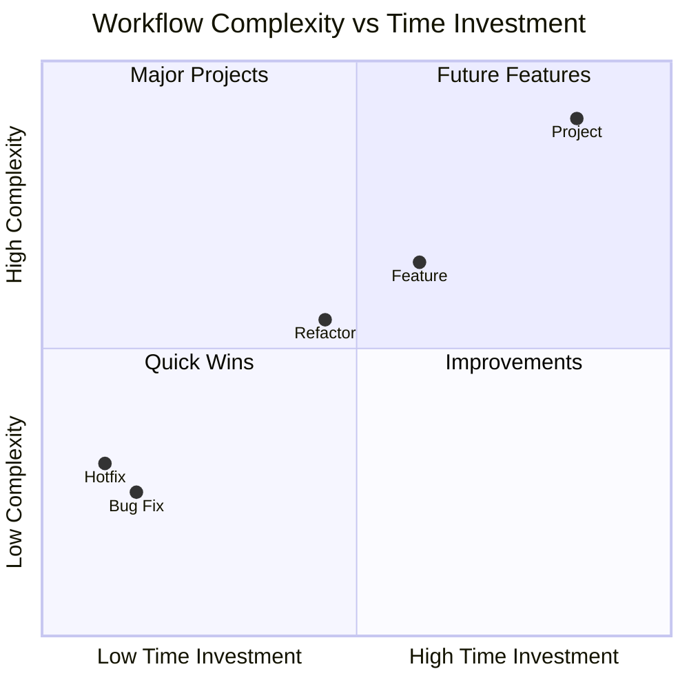

**Time Scale:**
- **45m-90m**: Bug Fix, Hotfix
- **2h-4h**: Small Refactors
- **1d-2d**: Feature Scoping
- **1w**: Feature Implementation
- **2w+**: Full Projects

---

## 🧠 Memory Access Pattern

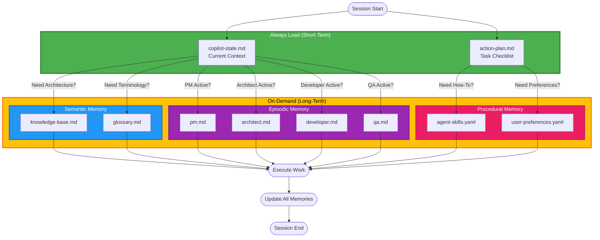

---

## 🎯 When To Use Each Workflow

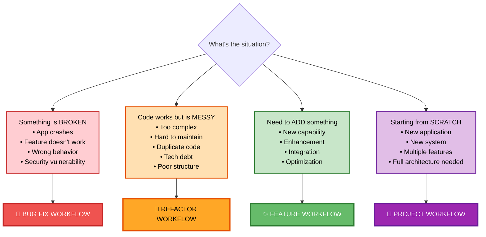

---

## 🔀 Workflow Transitions

You can switch workflows if the task evolves:

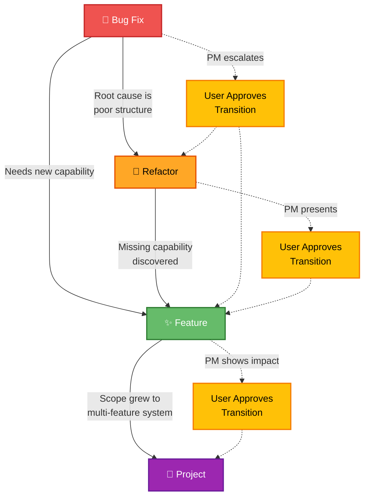

**All transitions require user approval**

---

## 📋 Workflow Selection Checklist

Before starting, ask yourself:

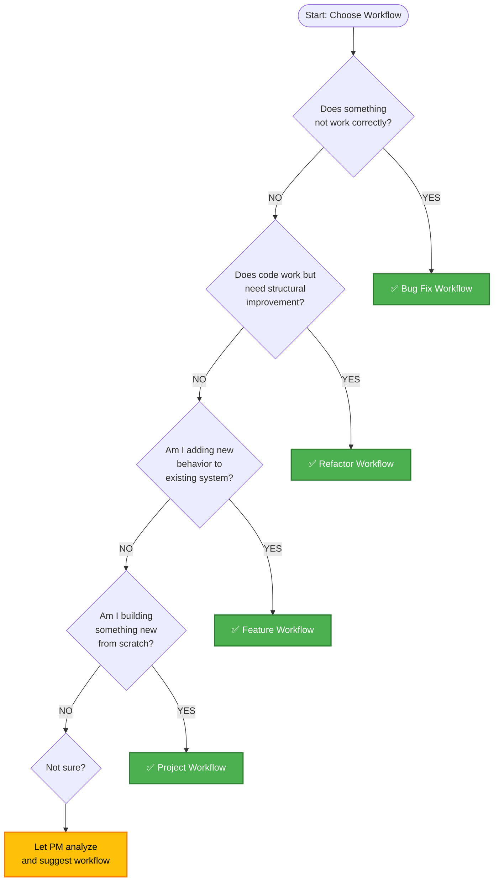

---

## 🎓 Learning Curve

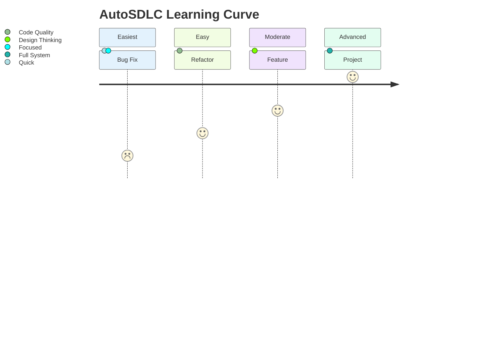

**Why this progression?**
- **🐛 Bug Fix**: Focused scope, clear objective, quick resolution
- **🔄 Refactor**: Requires understanding "good code" principles
- **✨ Feature**: Needs design thinking, integration analysis
- **🚀 Project**: Requires full system design, long-term planning

---

**Use these diagrams to:**
- Choose the right workflow for your task
- Understand the process before starting
- Explain AutoSDLC to your team
- Train new users on workflow selection

---

**For detailed architecture and system design, see ARCHITECTURE.md**

---

## 📊 Complete Workflow State Diagram (Mermaid)

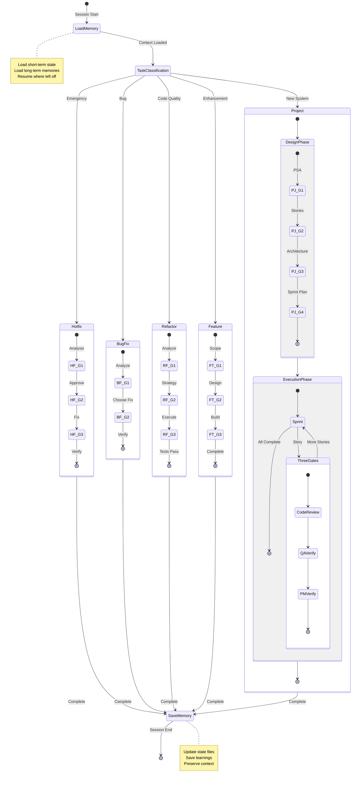

---

**For detailed architecture and system design, see ARCHITECTURE.md**
